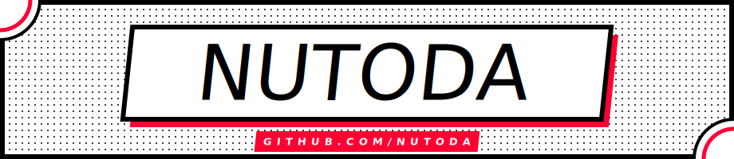

<!-- ─────────────────────────────  BANNER  ───────────────────────────── -->

  <picture>
    <source media="(prefers-color-scheme: dark)" srcset="assets/banner-dark.svg" />
    
  </picture>

<!-- ─────────────────────────────  LANG SWITCHER  ───────────────────────────── -->

  
  

 

<!-- ─────────────────────────────  ABOUT  ───────────────────────────── -->

  <b>Backend Developer</b> · Python / PHP / SQL · Docker · LLM integrations

  Building backends, autonomous agents, and dev tools.
  Open to collaborations on AI/LLM, LegalTech, and open-source infra projects.

---

<!-- ─────────────────────────────  00 СТЕК  ───────────────────────────── -->

  
  
  
  
  
  
  

---

<!-- ─────────────────────────────  01 ИНВЕНТАРЬ  ───────────────────────────── -->

<table width="100%">
  <tr>
    <td width="50%" align="center">
      <picture>
        <source media="(prefers-color-scheme: dark)" srcset="https://github-readme-stats-eight-theta.vercel.app/api?username=NUTODA&show_icons=true&hide_border=true&bg_color=0d1117&title_color=f0f6fc&icon_color=ff0033&text_color=f0f6fc&include_all_commits=true&count_private=true" />
        
      </picture>
    </td>
    <td width="50%" align="center">
      <picture>
        <source media="(prefers-color-scheme: dark)" srcset="https://github-readme-stats-eight-theta.vercel.app/api/top-langs/?username=NUTODA&layout=donut&hide_border=true&bg_color=0d1117&title_color=f0f6fc&text_color=f0f6fc&langs_count=8" />
        
      </picture>
    </td>
  </tr>
</table>

  <picture>
    <source media="(prefers-color-scheme: dark)" srcset="https://github-readme-streak-stats.herokuapp.com/?user=NUTODA&hide_border=true&background=0d1117&stroke=ff0033&ring=ff0033&fire=ff0033&currStreakLabel=ff0033&sideLabels=f0f6fc&sideNums=f0f6fc&dates=8b949e&currStreakNum=f0f6fc" />
    
  </picture>

---

<!-- ─────────────────────────────  01.5 ПРОЕКТЫ  ───────────────────────────── -->

| Проект | Стек | Описание |
|--------|------|----------|
| 🤖 [AI_Agent](https://github.com/NUTODA/AI_Agent) | Python · Playwright · Pydantic | Каркас для LLM-агентов в браузере: типизированный планировщик, мультишаговый рантайм, гард-рейлы и трейсы. |
| 🎞️ [GifToSteamWorkshop](https://github.com/NUTODA/GifToSteamWorkshop) | Python · Telegram Bot · FFmpeg | Бот, который режет GIF под Витрину Steam (5 слотов × 150px) и отдаёт готовый ZIP. |
| 🛒 [enf](https://github.com/NUTODA/enf) | Django · PostgreSQL · Docker · Stripe | Интернет-магазин: каталог, корзина, заказы, оплата через Stripe, Nginx + Gunicorn. |
| 📓 [Vistamed-TT](https://github.com/NUTODA/Vistamed-TT) | FastAPI · PostgreSQL · Docker | Асинхронный REST API дневника на SQLAlchemy + asyncpg в Docker Compose. |

---

<!-- ─────────────────────────────  02 АКТИВНОСТЬ  ───────────────────────────── -->

  <picture>
    <source media="(prefers-color-scheme: dark)" srcset="https://github-readme-activity-graph.vercel.app/graph?username=NUTODA&hide_border=false&bg_color=0d1117&color=f0f6fc&line=ff0033&point=f0f6fc&area=true&area_color=ff0033&radius=8" />
    
  </picture>

---

<!-- ─────────────────────────────  04 КОНТАКТЫ  ───────────────────────────── -->

  
  <!-- replace with actual Telegram handle if different from GitHub username -->
  
  

---

<!-- ─────────────────────────────  FOOTER  ───────────────────────────── -->

