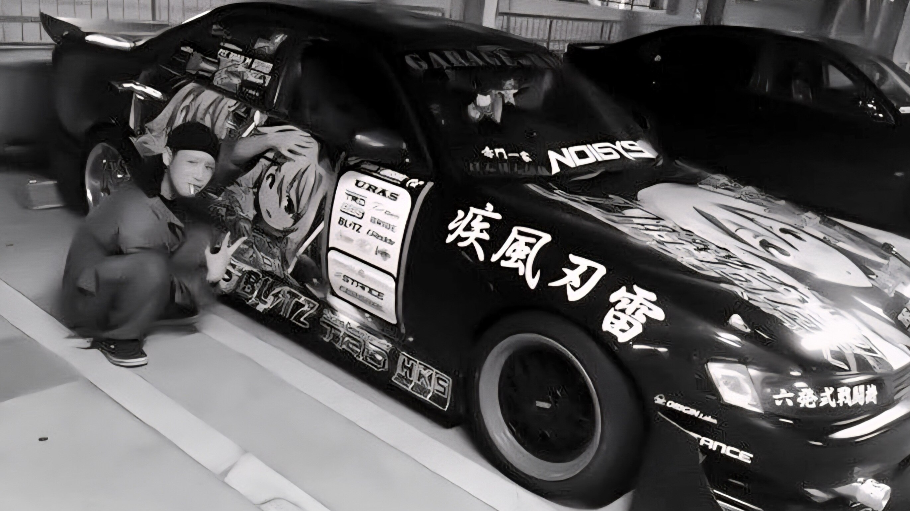
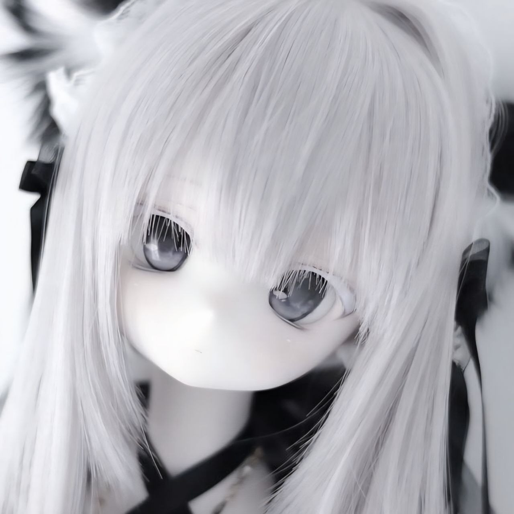
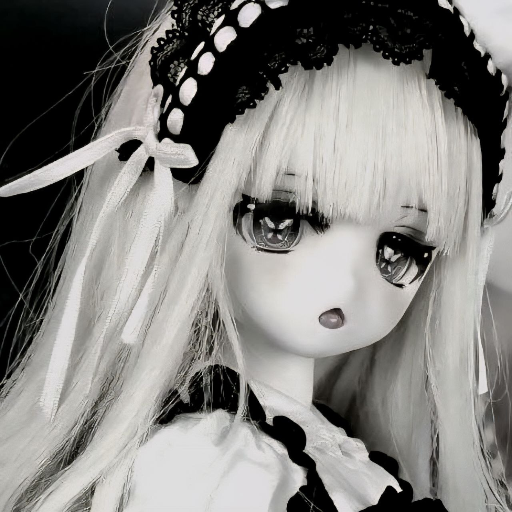

<!-- ─────────────────────────────  BANNER  ───────────────────────────── -->

  <picture>
    <source media="(prefers-color-scheme: dark)" srcset="assets/banner-dark.svg" />
    
  </picture>

<!-- ─────────────────────────────  LANG SWITCHER  ───────────────────────────── -->

  
  

 

<!-- ─────────────────────────────  HEADER CARD  ───────────────────────────── -->

<table width="100%">
  <tr>
    <td width="160" align="center" valign="middle">
      
    </td>
    <td valign="middle">
      <h2>NUTODA</h2>
      

        
        
        
      

      
Тут водятся коммиты, GIF-витрины для Steam и JDM-аниме.

    </td>
  </tr>
</table>

---

<!-- ─────────────────────────────  01 INVENTORY  ───────────────────────────── -->

<table width="100%">
  <tr>
    <td width="50%" align="center">
      <picture>
        <source media="(prefers-color-scheme: dark)" srcset="https://github-readme-stats-eight-theta.vercel.app/api?username=NUTODA&show_icons=true&hide_border=true&bg_color=0d1117&title_color=f0f6fc&icon_color=ff0033&text_color=f0f6fc&include_all_commits=true&count_private=true" />
        
      </picture>
    </td>
    <td width="50%" align="center">
      <picture>
        <source media="(prefers-color-scheme: dark)" srcset="https://github-readme-stats-eight-theta.vercel.app/api/top-langs/?username=NUTODA&layout=donut&hide_border=true&bg_color=0d1117&title_color=f0f6fc&text_color=f0f6fc&langs_count=8" />
        
      </picture>
    </td>
  </tr>
</table>

  <picture>
    <source media="(prefers-color-scheme: dark)" srcset="https://github-readme-streak-stats.herokuapp.com/?user=NUTODA&hide_border=true&background=0d1117&stroke=ff0033&ring=ff0033&fire=ff0033&currStreakLabel=ff0033&sideLabels=f0f6fc&sideNums=f0f6fc&dates=8b949e&currStreakNum=f0f6fc" />
    
  </picture>

---

<!-- ─────────────────────────────  02 ACTIVITY  ───────────────────────────── -->

  <picture>
    <source media="(prefers-color-scheme: dark)" srcset="https://github-readme-activity-graph.vercel.app/graph?username=NUTODA&hide_border=false&bg_color=0d1117&color=f0f6fc&line=ff0033&point=f0f6fc&area=true&area_color=ff0033&radius=8" />
    
  </picture>

---

<!-- ─────────────────────────────  03 ILLUSTRATIONS  ───────────────────────────── -->

  

  
  
  

Miu Miu · ☆⌒(＞。≪) · (´TωT`) · _￠(･ω･｀)

---

<!-- ─────────────────────────────  FOOTER  ───────────────────────────── -->

