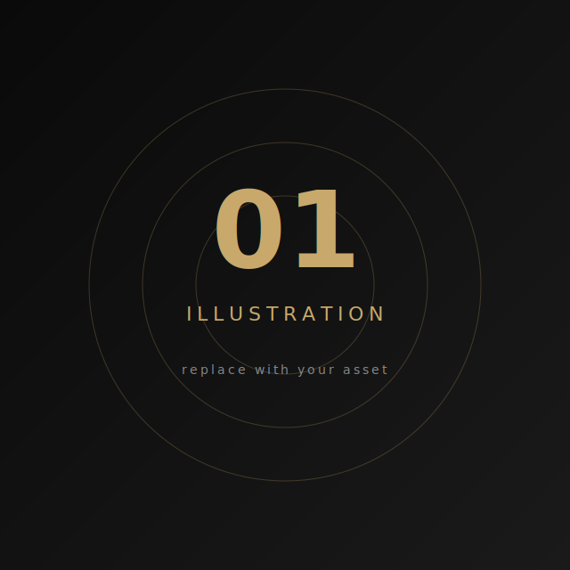
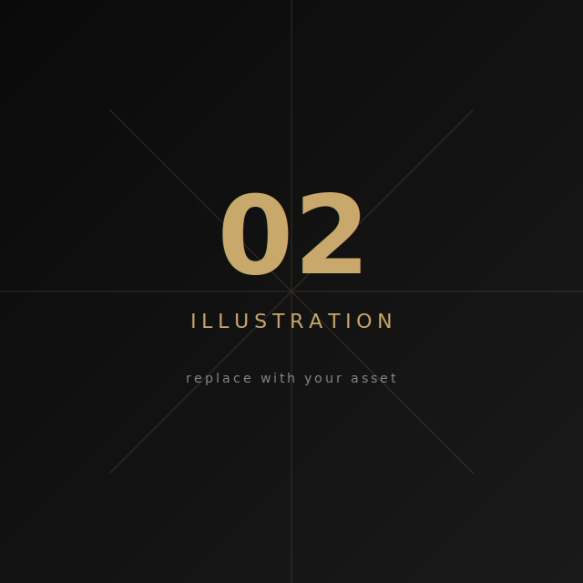
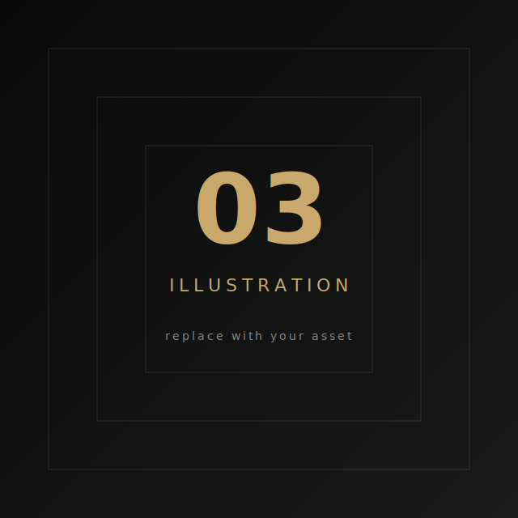

<!--
  ███╗   ██╗██╗   ██╗████████╗ ██████╗ ██████╗  █████╗
  ████╗  ██║██║   ██║╚══██╔══╝██╔═══██╗██╔══██╗██╔══██╗
  ██╔██╗ ██║██║   ██║   ██║   ██║   ██║██║  ██║███████║
  ██║╚██╗██║██║   ██║   ██║   ██║   ██║██║  ██║██╔══██║
  ██║ ╚████║╚██████╔╝   ██║   ╚██████╔╝██████╔╝██║  ██║
  ╚═╝  ╚═══╝ ╚═════╝    ╚═╝    ╚═════╝ ╚═════╝ ╚═╝  ╚═╝
       Steam-style GitHub profile · welcome
-->

 

 

<!-- ─────────────────────────────  PROFILE HEADER  ───────────────────────────── -->

<table width="100%" align="center">
  <tr>
    <td width="40%" align="center" valign="top">
       
      <b>NUTODA</b> 
       Poland
    </td>
    <td width="60%" align="left" valign="top">
      

        
        
      

      

        <b>Currently Offline</b> 
        Commits, Steam GIF showcases and JDM-anime live here.
      

    </td>
  </tr>
</table>

---

<!-- ─────────────────────────  WORKSHOP SHOWCASE  ───────────────────────── -->

### Workshop Showcase

<table>
  <tr>
    <td colspan="2" align="left">
      
      <b>NUTODA's Workshop</b>
    </td>
  </tr>
  <tr>
    <td>
      
    </td>
    <td>
      
    </td>
  </tr>
  <tr>
    <td>
      
    </td>
    <td>
      
    </td>
  </tr>
</table>

<b>30</b> submissions · <a href="https://github.com/NUTODA?tab=repositories">all repositories →</a>

---

<!-- ─────────────────────────────  ARTWORK  ───────────────────────────── -->

### Artwork Showcase

  
  
  

  

<i>快風刃零</i> · Miu Miu

---

<!-- ─────────────────────────────  INVENTORY  ───────────────────────────── -->

### Inventory

<table align="center">
  <tr>
    <td>
      
    </td>
    <td>
      
    </td>
  </tr>
</table>

  

  Workshop items · <b>30</b> &nbsp;·&nbsp; Reviews · <b>2</b> &nbsp;·&nbsp; Artwork · <b>4</b>

---

<!-- ─────────────────────────────  BADGES  ───────────────────────────── -->

### Badges

  

  
  
  
  

---

<!-- ─────────────────────────────  GROUPS  ───────────────────────────── -->

### Groups

<table>
  <tr>
    <td width="60"></td>
    <td>
      <b>Hentai!</b> 
      Members: 1,462,579
    </td>
  </tr>
</table>

---

<!-- ─────────────────────────────  SNAKE  ───────────────────────────── -->

<picture>
  <source media="(prefers-color-scheme: dark)" srcset="https://raw.githubusercontent.com/NUTODA/NUTODA/output/github-contribution-grid-snake-dark.svg" />
  <source media="(prefers-color-scheme: light)" srcset="https://raw.githubusercontent.com/NUTODA/NUTODA/output/github-contribution-grid-snake.svg" />
  
</picture>

<!-- ─────────────────────────────  FOOTER  ───────────────────────────── -->

